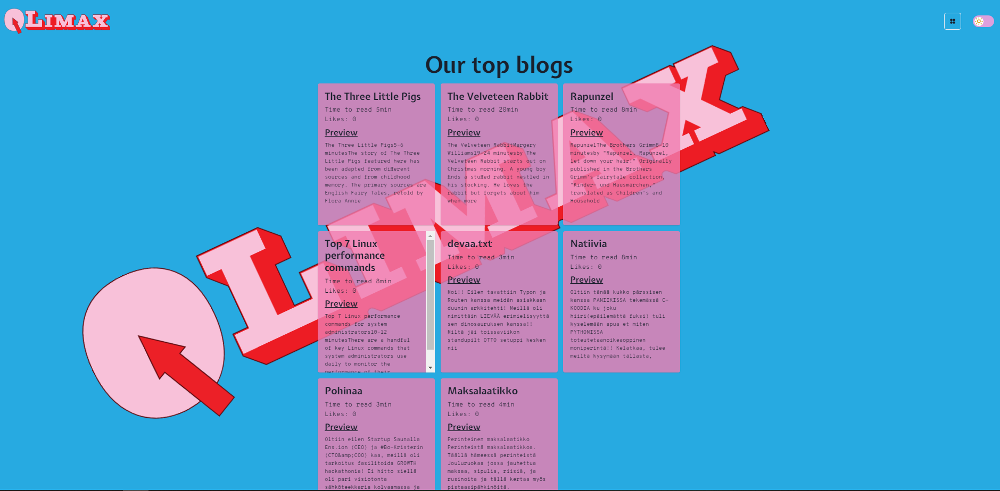

# QLimax

Welcome to QLimax Blog Platform, a TypeScript-based blog platform utilizing React, GraphQL with Apollo Client, MongoDB, and deployed on Vercel.

## [Qlimax](https://qlimax.lol/)



## Introduction

QLimax is designed to provide a streamlined experience for both bloggers and readers with pleasant easy-to-eye UI. It offers users a platform to share their thoughts, engulf in conversation in comment section and like others blogs. QLimax is a solid blogging platform with its use of modern technologies like TypeScript, React, GraphQL, and Apollo Client, along with the reliability of MongoDB for data storage and Vercel for deployment, it offers a robust and scalable solution for managing and sharing blog content.

## Development

1. **Clone the Repository:**

   ```
   git clone https://github.com/RauliYoung/QLimax.git
   ```

2. **Install the Dependencies:**

   ```
   npm i
   ```

3. **Set Up Environment Variables:**

> You need to rename **_.env.example_** file in the root of the project to .env and add 2 environment variables with

```
DATABASE_URI
JWT_SECRET
SG_API_KEY
```

4. **Run the Development Server:**

   ```
   npm run dev
   ```

5. **Open the Application:**

   Once the server is running, open your browser and navigate to `http://localhost:3000` to view the application.

## Technologies

- **React Frontend:** Utilizes React for building a dynamic and responsive user interface.
- **GraphQL API:** Utilizes GraphQL for efficient querying and manipulation of blog data.
- **Apollo Client:** Integrates with Apollo Client for seamless data fetching and management on the client-side.
- **MongoDB:** Stores data reliably and allows for easy scalability as the platform grows.
- **NextJS:** Utilizes modern server-side rendering and routing for fast and efficient page loads.
- **Chackra UI:** Utilizes Chackra UI for building a consistent and visually appealing user interface.
- **Vercel Deployment:** Takes advantage of Vercel's platform for easy deployment, continuous integration, and scalability.

## Features

# Platform Features Overview

Welcome to our platform! Here's a quick guide to the features we offer to enhance your experience:

### User Authentication

- **Secure Sign Up & Login**: Sign up for new accounts securely, log in to access your data, and log out when done.
- **Unique User Identity**: Ensures each user has a unique identity and access to their personal data.

### Blogging

- **Create Blog Posts**: Share your thoughts, experiences, or expertise. Full control to edit or delete your posts.
- **Browse & View Blogs**: Discover new content and explore various topics of interest.
- **Engage**: Leave comments to foster discussion and express appreciation through likes.

### Community Interaction

- **Commenting**: Engage with content by leaving comments, encouraging discussion and feedback.
- **Liking**: Show appreciation for content that resonates with you.

### Responsive Design

- **Cross-Device Compatibility**: Enjoy an optimal viewing experience across all devices, including desktops, tablets, and smartphones.

### Safety & Security

- **Protection Measures**: Implementations like password hashing and validation protect your account and sensitive information.
- **Email Confirmation**: Verify account validity and reduce spam with email confirmation upon sign-up.

### Scalability & Performance

- **Ready for Growth**: Built to accommodate an increasing number of users and content without compromising on performance.
- **Optimized Experience**: Enjoy fast load times and smooth interactions, ensuring a seamless experience.

### Additional Features

- **Day/Night Mode**: Switch between light and dark mode based on your preference or environmental conditions.

Enjoy exploring these features and more as you use our platform!

### Ai Spellchecker

While editing blog post hover on text to enable AI spellchecker.

Supported languages:

- English

## Developers

<p align="center">
  <b>Tristan Ellenberg:</b> <a href="https://github.com/RauliYoung">GitHub</a>&nbsp;&nbsp;&nbsp;
  <b>Joonas Jouttijärvi:</b> <a href="https://github.com/joonasjouttijarvi">GitHub</a>&nbsp;&nbsp;&nbsp;
  <b>Niko Mäenpää:</b> <a href="https://github.com/Mashadeve">GitHub</a><br/><br/>
  
</p>
