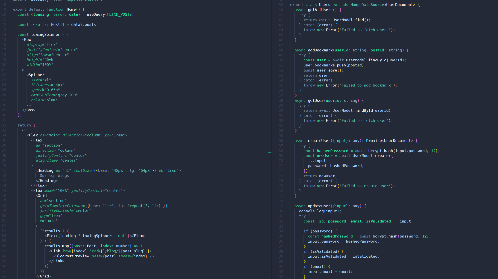

# QLimax

Welcome to QLimax Blog Platform, a TypeScript-based blog platform utilizing React, GraphQL with Apollo Client, MongoDB, and deployed on Vercel.

## Introduction

QLimax is designed to provide a streamlined experience for both bloggers and readers with pleasant easy-to-eye UI. It offers users a platform to share their thoughts, engulf in conversation in comment section and like others blogs. QLimax is a solid blogging platform with its use of modern technologies like TypeScript, React, GraphQL, and Apollo Client, along with the reliability of MongoDB for data storage and Vercel for deployment, it offers a robust and scalable solution for managing and sharing blog content.

1. **Clone the Repository:**

   ```
   git clone https://github.com/RauliYoung/QLimax.git
   ```

2. **Install the Dependencies:**

   ```
   npm i
   ```

3. **Set Up Environment Variables:**

   your own mongodb connection string and sendgrid mailer api key

   ```
   DATABASE_URI
   JWT_SECRET
   SG_API_KEY
   ```

4. **Run the Development Server:**

   ```
   npm run dev
   ```

5. **Open the Application:**

   Once the server is running, open your browser and navigate to `http://localhost:3000` to view the application.

## Technologies

- **React Frontend:** Utilizes React for building a dynamic and responsive user interface.
- **GraphQL API:** Utilizes GraphQL for efficient querying and manipulation of blog data.
- **Apollo Client:** Integrates with Apollo Client for seamless data fetching and management on the client-side.
- **MongoDB:** Stores data reliably and allows for easy scalability as the platform grows.
- **NextJS:** Utilizes
- **Vercel Deployment:** Takes advantage of Vercel's platform for easy deployment, continuous integration, and scalability.



## Features

- **User Authentication:** This feature allows users to securely sign up for new accounts, log in to existing accounts, and log out when they're done using the platform. It ensures that each user has a unique identity and access to their own data.
- **Blog Creation:** Users can create their own blog posts, providing them with a platform to share their thoughts, experiences, or expertise with others. They can also edit or delete their own posts as needed, giving them full control over their content.
- **Blog Viewing:** Users can browse and view all available blog posts, enabling them to discover new content and explore topics of interest. Additionally, they can view individual blog posts in detail to read the full content and engage with it further.
- **Commenting:** This feature allows users to engage with blog posts by leaving comments. It encourages discussion, feedback, and interaction between users and authors, fostering a sense of community within the platform.
- **Liking:** Users have the option to express their appreciation for blog posts by liking them. This feature provides positive feedback to authors and helps highlight popular or well-received content.
- **Responsive Design:** The platform is designed to provide an optimal viewing experience across a wide range of devices and screen sizes, including desktop computers, tablets, and smartphones. It ensures that users can access and enjoy the platform regardless of the device they're using.
- **Safety and Security:** Security measures such as password hashing and validation are implemented to protect user accounts and sensitive information. These measures help safeguard user data and prevent unauthorized access or tampering.
- **Email confirmation:** When users sign up for a new account, they are required to confirm their email address via a confirmation link sent to their email inbox. This helps verify the validity of user accounts and reduce the risk of spam or fraudulent registrations.
- **Scalability:** The platform is built to handle a growing number of users and blog posts without sacrificing performance or user experience. It can accommodate increased traffic and data volume as the platform becomes more popular over time.
- **Performance:** The platform is optimized for speed and efficiency, providing fast load times and smooth interactions for users. This ensures a seamless and enjoyable experience, even when accessing content or performing actions on the platform.
- **Day/Night Mode:** Users have the flexibility to switch between light and dark mode based on their preferences or environmental conditions. This feature enhances user comfort and readability, especially during extended usage sessions or in low-light environments.

## Developers

<p align="left">
Tristan Ellenberg: [GitHub](https://github.com/RauliYoung)
</p>

<p align="center">
Joonas Jouttijärvi: [GitHub](https://github.com/joonasjouttijarvi)
</p>

<p align="right">
Niko Mäenpää: [GitHub](https://github.com/Mashadeve)
</p>

<!-- - **Tristan Ellenberg:** [GitHub](https://github.com/RauliYoung)
- **Joonas Jouttijärvi:** [GitHub](https://github.com/joonasjouttijarvi)
- **Niko Mäenpää:** [GitHub](https://github.com/Mashadeve) -->

<p align="center">

</p>
